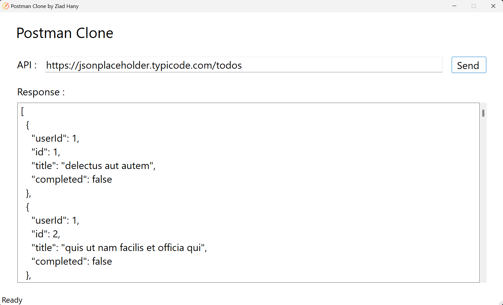

# Postman Clone
Postman Clone provides a user-friendly interface for making HTTP requests to APIs and viewing the responses in formatted JSON. Ideal for developers and testers, this tool simplifies API interaction and debugging, helping you efficiently validate and troubleshoot your API calls.

##  Technologies Used
* C#
* .NET 8
* WinForms
* HttpClient

## Using The App
1. Download the excutable file from the release section.
     
2. When the application lanches, it should look like this:
     
   
     
3. Fill in your API URL and hit Send:
     
   

4. Hire me.

## Upcoming Changes
* Adding POST, PUT, PATCH, DELETE functionality
* Adding API headers
* Handling API authentication
* Adding Dependency Injection
* Adding Logging
* Create a web-based user interface for the application
