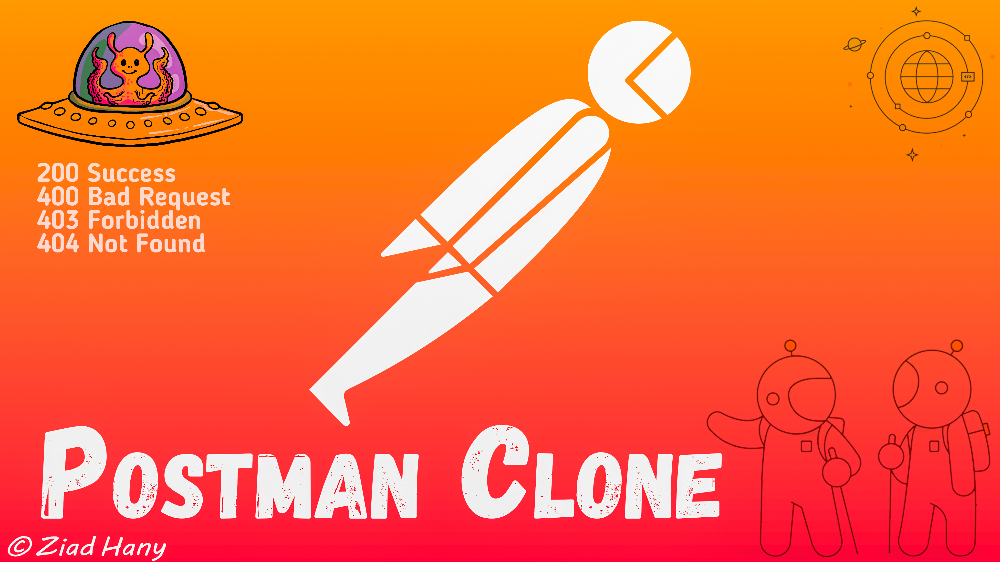
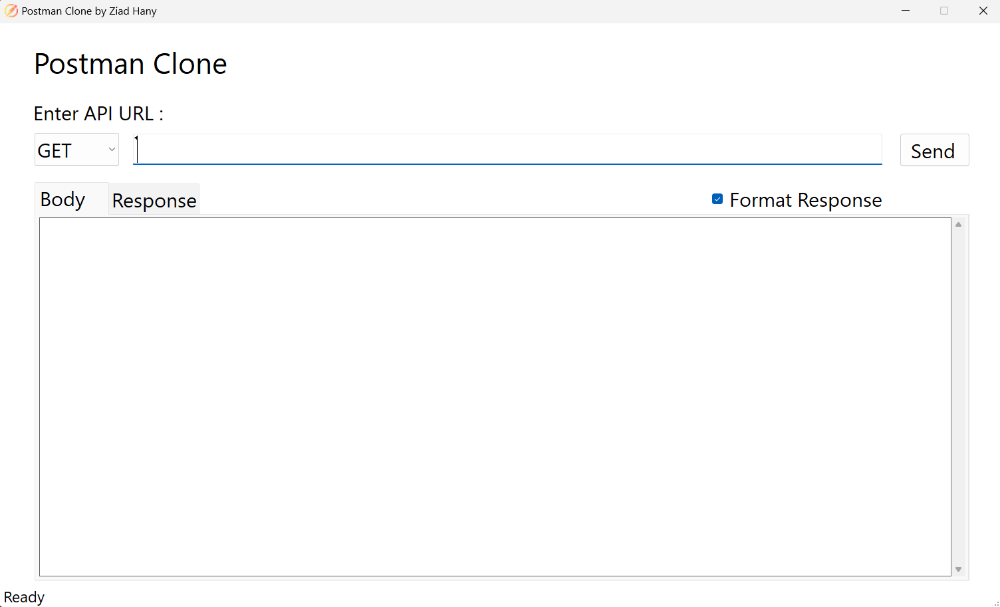
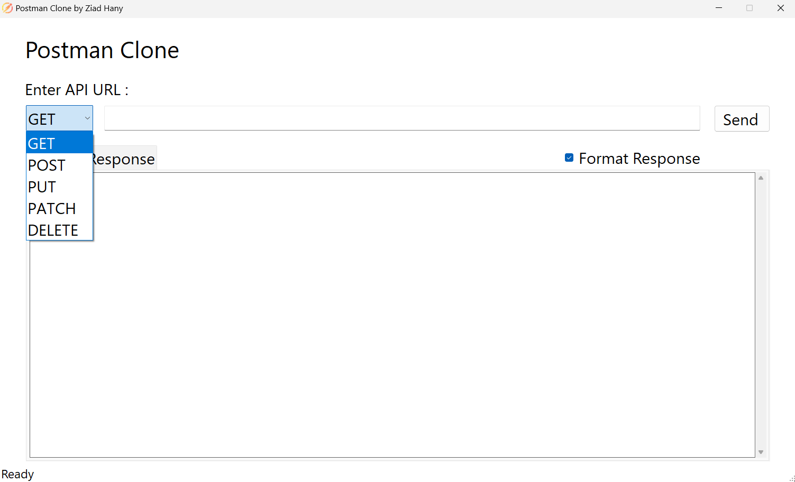
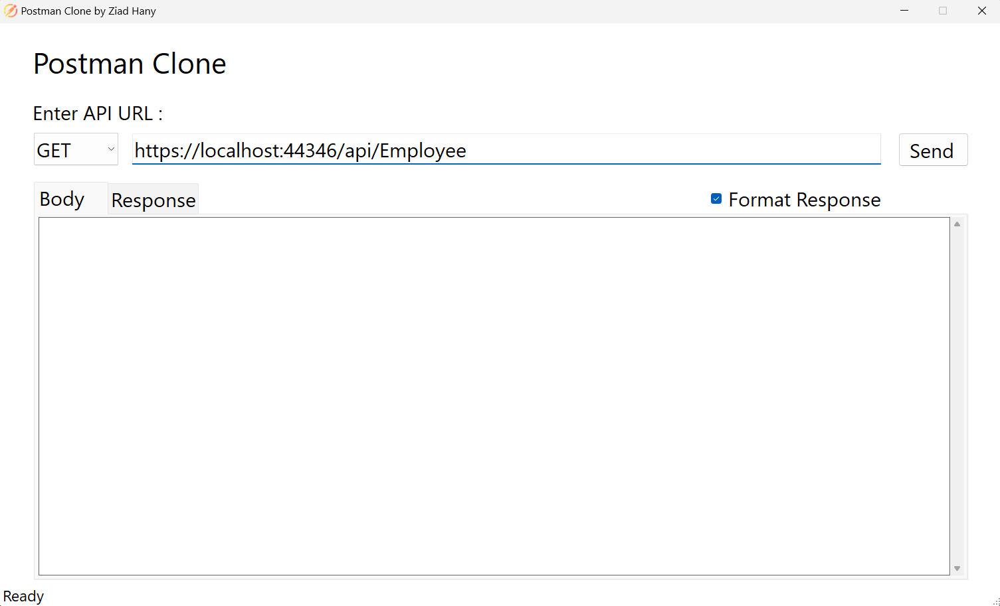
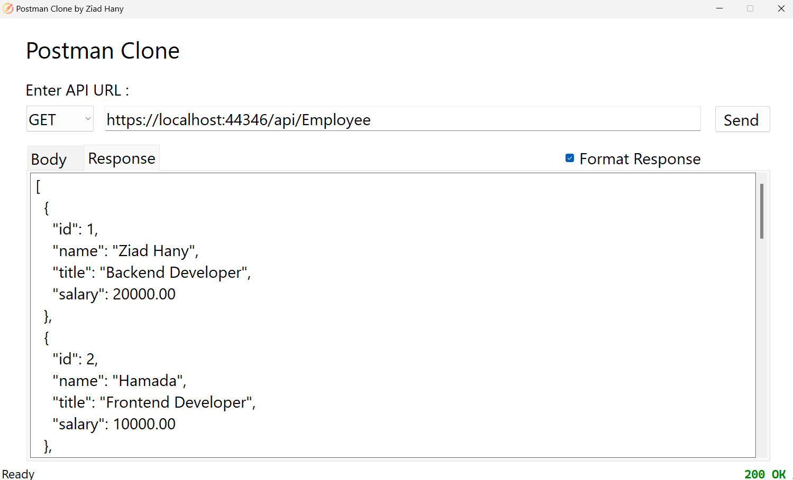
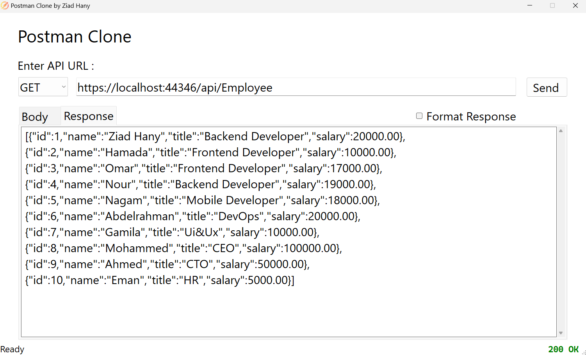

# Postman Clone

**Postman Clone** is a tool designed for developers and testers to simplify the process of making HTTP requests to APIs and viewing responses in formatted JSON. With its user-friendly interface, it streamlines API interaction and debugging, allowing for efficient validation and troubleshooting of API calls.

## Technologies Used

- **C#**
- **.NET 8**
- **WinForms**
- **HttpClient**

## Getting Started

1. **Download the Executable File**: Obtain the latest version from the [releases section](https://github.com/ziadhanii/Postman-Clone-App/releases/tag/v2.0.0).

2. **Launching the Application**: When you open the app, it should appear as shown below:

   

3. **Select HTTP Verb**: Choose the desired HTTP verb from the dropdown menu:

   

4. **Enter API URL**: Input your API URL and click 'Send':

   

5. **Format Response**: 
   - **Checked**: The response will be formatted as follows:

     

   - **Unchecked**: The response will appear unformatted:

     

6. **[Hire Me](#)**: If you're interested in collaborating or hiring me for projects, feel free to reach out!

## Upcoming Features

- **API Headers**: Adding support for API headers.
- **API Authentication**: Implementing authentication mechanisms.
- **Dependency Injection**: Integrating Dependency Injection.
- **Logging**: Adding logging functionality.
- **Web-Based UI**: Developing a web-based user interface for the application.
